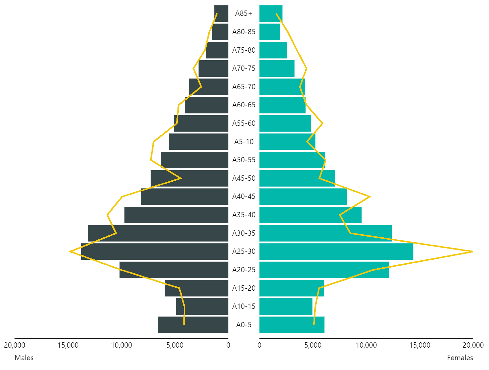

# powerBI-visual-PopPyramid3
Power BI custom visual showing a population pyramid

  

This custom visual for Microsoft Power BI displays a population pyramid. The visual supports:
+ Free choice of categories on the y-axis for age ranges (the visual works best with 5yr age ranges rather than single year).
+ Cusomisation of both labelling and colour of left and right bars, as well as value to be search within the gender column for each bar (e.g. Male, Males, M)
+ Responsive to cross filtering when clicking on other visuals and supports highlighting.
+ Ability to select individual bars, age ranges, or gender labels to filter other visuals (to select multiple categories hold down the ctrl-key).

Note:
+ Whilst it is possible to select multiple bars it is only possible to cross filter other visuals for the first bar (multiple bar selections is not supported), however, selecting multiple age range or gender categories is supported.
+ Cross visual highlighting is not supported.

Sample data is included within the Sample Data folder.
