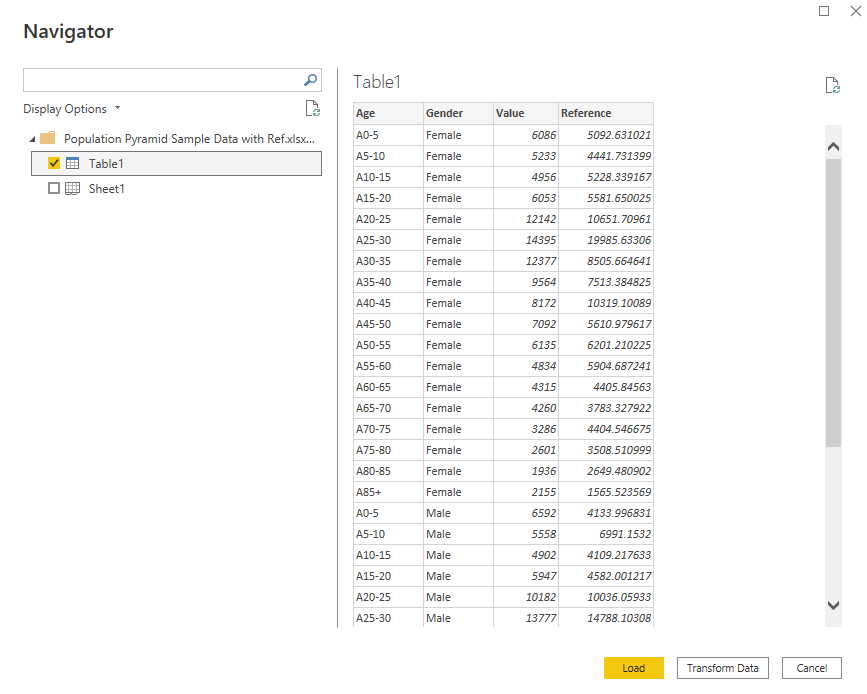

# Sample data for population pyramid

Sample data is provided to demonstrate how to use the data in PowerBI desktop and
confirm that the visual is working.

The sample data is included as a table within the Microsoft Excel workbook.
It is loaded into PowerBI using Get data.

The visual is loaded by clicking the three dot elipse in the Visualisations pane,
then selecting the get more visualisations dialogue. The selector for the visual
will appear below the divider line.

**IMPORTANT** The visualisation uses the gender column to separate data for display
on the left and right of the population pyramid. For maximum flexibility this is a
parameter which must be set in the visual to match the labels in the data. The
visualisation defaults to *Males* and *Females*, however, this needs to be changed
to match the sample data which is *Male* and *Female*.

